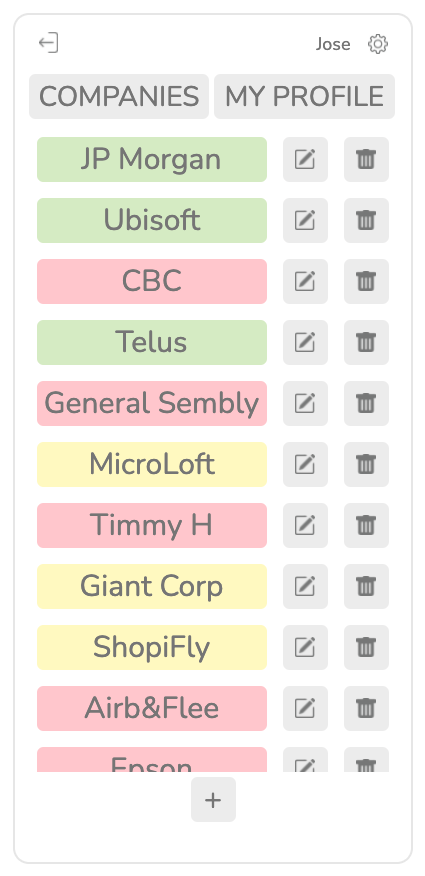
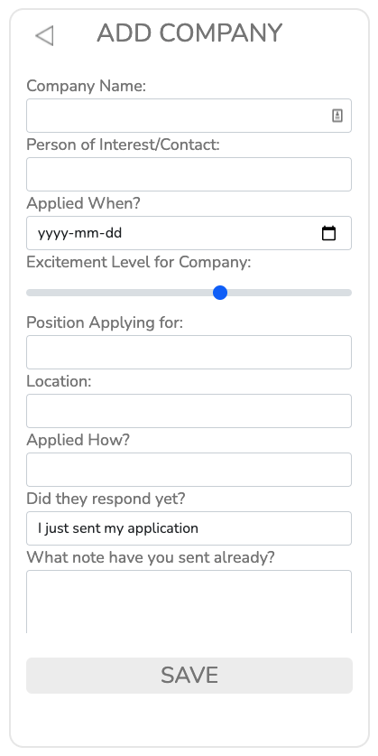
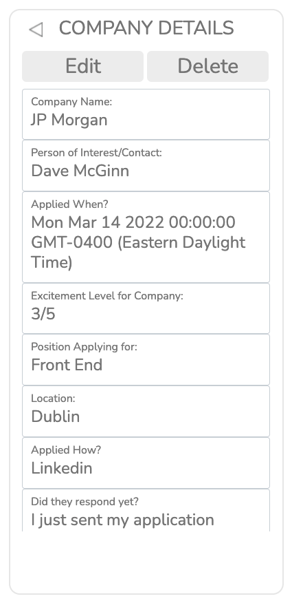
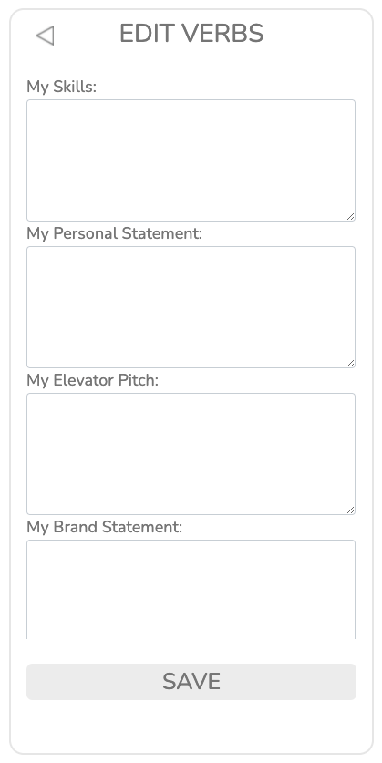
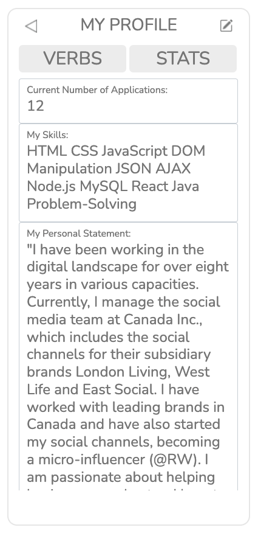
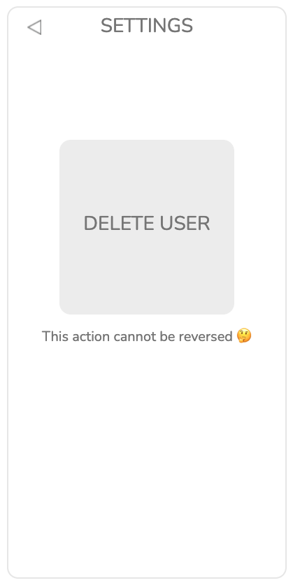
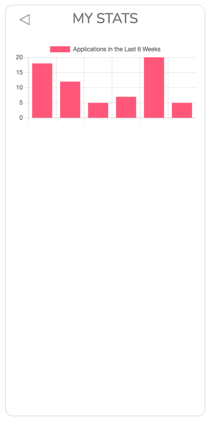

<h1><i>APPLIED4 v.2</h1>
<h5>SEI 48 Project II<h5>

<a href="https://github.com/JP4441/applied4-app-p2/issues">Report Bug</a>

<h4>Thank you for taking the time to look at my project! Keeping track of jobs applied, persons of interest contacted, and company specifics can be tricky. This app was created with career search best practices in mind and hopes to help fellow students maximize their chances of landing that dream job.<h4>

# Details:

- Type of website: Dynamic.
- Time of completion: 7 days.
- Started last day of week 5 during bootcamp.

# Applied4 - Application Tracker App

- This app does three things: 1. Lets users create company profiles with important details, 2. lets users edit the date of when they sent their application. 3. lets users to create their own profile where they can keep information about themselves such as: elevator pitch, personal statement, brand statement, smart questions to ask, etc.
- If the application was sent less than 10 days ago the company's button turns green, if it was sent between 10 and 20 days it turns yellow, and if the application is 20+ days old, it turns red. This was done with the intention of providing visual cues to applicants so they can keep track of time, and when to send follow-ups or not.

# Features:

- Login and Sign up
- Add, modify, and delete companies and profile
- Time passed from date of application visual cues
- Profile Delete
- Mobile friendly

# Next Steps:

- Fix CSS bugs.
- Complete statistics page so users can see number of applications sent within last 6 weeks.

# Technologies Used

- NodeJS
- Express
- MongoDB
- Mongoose
- HTML
- CSS
- Javascript
- ChartJS
- Bootstrap 5
- Heroku
- Adobe Illustrator

# You can test the app [**HERE**](https://project2applied4.herokuapp.com/)

|            Main             |       Create Company        |
| :-------------------------: | :-------------------------: |
|  |  |

|    Edit Company Details     |       Create Profile        |
| :-------------------------: | :-------------------------: |
|  |  |

|         My Profile          |       Delete Account        |
| :-------------------------: | :-------------------------: |
|  |  |

| My Stats  
| :-------------------------:  
| 
